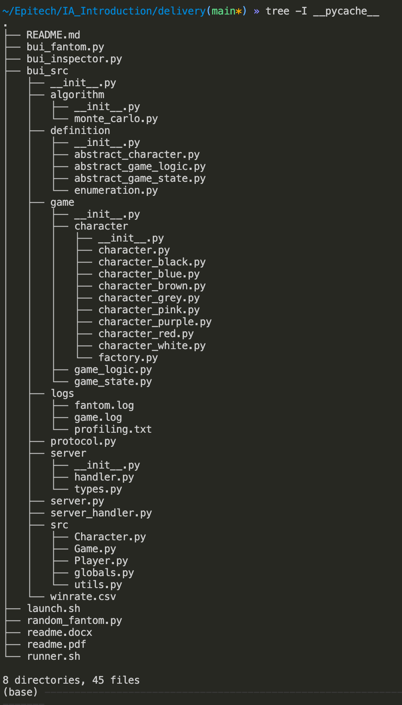
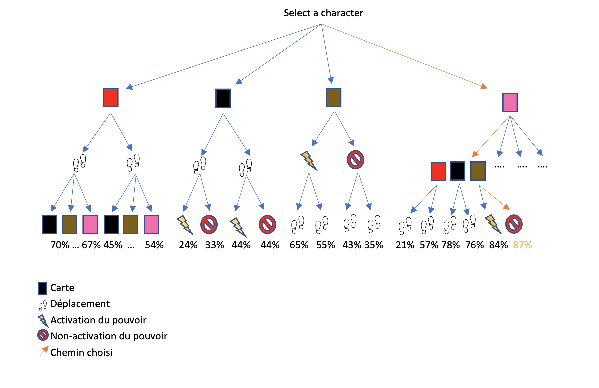
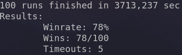

# The Phantom of the opera


We have created an artificial intelligence program for the board game 'The Phantom of the Opera'. This document describes the realization and the functioning of the various parts which compose this program.

# Program presentation

The different parts of the program will be presented in the chronological order of their realization. First we had to study the game logic to realize it so that it could simulate games from a C configuration of the game, then we were interested in the Monte Carlo method. In order to complete and optimize the latter, we decided to implement a learning over time to our program. Finally, we realized a script allowing us to rerun a number X of games, and to determine our winrate.



### GameLogic

We first studied the game and all its specificities. The goal was to understand all the subtleties of the game, in order to be able to remake it to simulate games from a given configuration. The first implementation of the speaker's game was very useful because we were able to draw inspiration from it in order to create our own game, more flexible. It is composed of three parts, first the game logic (game_logic.py) which contains only the rules and the different possible effects, which is only used to govern the game from a configuration. Then comes the game state (game_state.py) which contains the current configuration of the game, i.e. all the parameters related to the game, such as the position of the carlotta, the blocked passage, the list of the different characters, etc. The last part is about the different characters, which contain information about them, such as their position or if they are suspects, as well as the methods that implement their different powers. The realization of this part was essential to be able to start working on the Monte Carlo method.

### Monte Carlo

We chose to implement a Monte Carlo since this method piqued our curiosity during the course, and no member of the group had already realized one. The functioning of our Monte Carlo is rather simple: with a game state (game_state), this class will realize a tree of depth P. Once all the possibilities are found, we simulate a number X (number_simulated_games) of games to choose from in order to have a percentage of wins for each branch. In order to optimize the realization of these games, we decided to use threads to parallelize the games. But facing the possibility of a large number of branches, we opted for a learning process in order not to replay the games already simulated.


### Learning

As explained previously, this part aims to lighten the program by keeping the percentage of victory of a given configuration thanks to Monte Carlo. The operation is very simple, when we arrive at the end of a branch, we have a game state noted Sy and we must simulate X games to have a percentage of victories. But before simulating them, our program will first look in the file winrate.csv for this same configuration Sy. If it finds the Sy configuration, then it keeps the percentage of victory associated to it in this file, and does not simulate the X games because it has already been done in a previous game. If it does not find the Sy configuration, it simulates the X games, then writes in the file the Sy configuration and its victory percentage so that it can be possibly used during a future game.

### Scripting

Our script is composed of a wrapper, launch.sh, allowing to launch the server with all components (AI and random_phantom). It allows to parse the return of the server and to extract useful information after the end of the game in the form of a CSV line containing winner, ghost, score-final or timeout in case of server timeout. Then, it contains a wrapper of launch.sh, runner.sh, allowing to run a number, given in parameter, of games and to recover useful information. We have thus, for each game, the if it is won, lost, or timeout as well as the execution time of this one. After each game has been played, we have the total time of the execution of the games, as well as the winrate, the number of wins and the number of timeouts.



# Run
To launch a number N of games:

```sh
./runner.sh N [bui_inspector.py | random_inspector.py] [bui_fantom.py | random_fantom.py]
```

To launch a game:

```sh
launcher.sh [bui_inspector.py | random_inspector.py] [bui_fantom.py | random_fantom.py]
```

To launch a game and get the detailed output of the server, you just have to open 3 terminals, and use respectively:

```sh
python bui_src/server.py
```

```sh
python [bui_inspector.py | random_inspector.py]
```

```sh
python [bui_fantom.py | random_fantom.py]
```

The detail of the output will be on the server terminal, as well as in the logs in the bui_src folder.

# Observations

After completing and testing this project, we were able to make some observations.

### Winrate

The winrate obtained converges around 80% of wins against a random ghost.

### Limits

Unfortunately we still encounter too many timeouts, due to the fact that we have not yet encountered all possible game configurations. After investigation we noticed that the time-out was not due to the number of simulated games, but to the number of final branches in the tree. Logically enough, the more possibilities there are, the longer it takes to explore the branches and the higher the risk of time-out.

### Improvements

Once the winrate.csv file is filled with almost all possible game configurations, we can increase the depth without the risk of time-out, and we believe this increase will result in an increase of our winrate.

